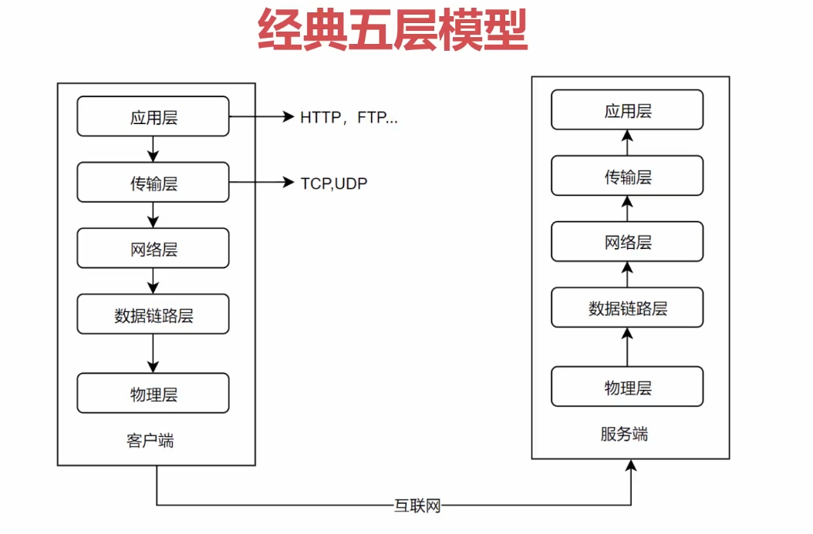

<!--
 * @Description: In User Settings Edit
 * @Author: your name
 * @Date: 2019-09-23 09:57:19
 * @LastEditTime: 2019-09-23 10:16:27
 * @LastEditors: Please set LastEditors
 -->
# 5层网络模型

## 低三层
* 物理层
   * 定义物理设备怎样传输数据
* 数据链路层
   * 在通信的实体间建立数据链路连接
* 网络层
   * 数据在节点之间创建逻辑链路

## 传输层
* 向用户提供端到端的服务
* 向高层屏蔽了下层数据通信的细节

## 应用层
* 构建于TCP之上的
* 屏蔽网络传输的细节
  