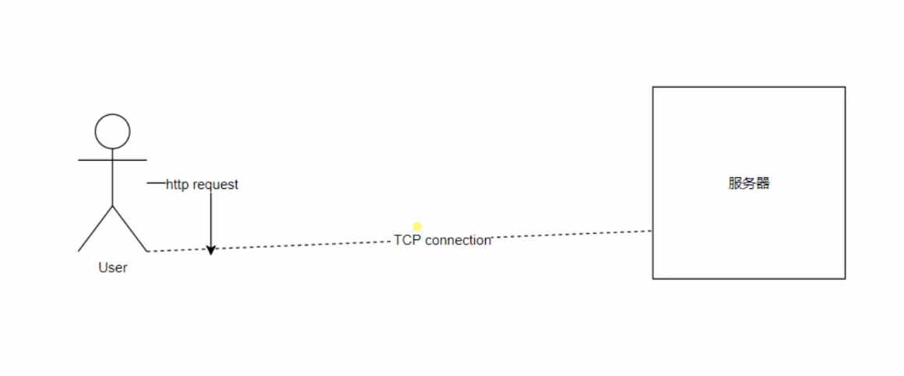
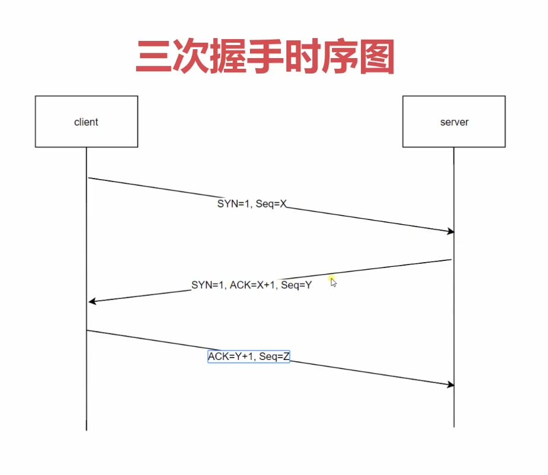

<!--
 * @Description: In User Settings Edit
 * @Author: your name
 * @Date: 2019-09-23 10:37:24
 * @LastEditTime: 2019-09-23 10:50:55
 * @LastEditors: Please set LastEditors
 -->
## http请求示例

http是不能创建连接的，需要tcp来创建，tcp创建的连接是可以一直存在那里的，http的请求是在这个连接的基础上去发送的。
在tcp连接上是可以发送多个http请求的。在不同的http版本上这个模式是不一样的。
http1.0:tcp连接是在http发送请求的时候就会创建，当http完成了请求并且服务端响应后，tcp连接就关闭了。
http:1.1:tcp连接可以通过一些方式让他保持在那里（chrome里面是6次http请求），当第二个http请求过去后还是使用这个tcp连接。（好处就是减少了tcp连接的三次握手开销）
http2:http请求在tcp链接里面是可以并发的，只需要一个tcp链接

## 创建tcp连接三次握手
> 创建三次握手是为了规避因为网络延迟导致的服务器开销的问题

