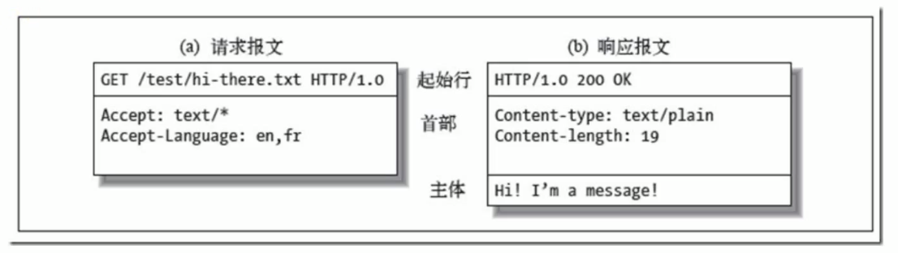

<!--
 * @Description: In User Settings Edit
 * @Author: your name
 * @Date: 2019-09-23 11:02:57
 * @LastEditTime: 2019-09-23 11:18:05
 * @LastEditors: Please set LastEditors
 -->

## HTTP方法
* 用来定义对于资源的操作
* 常用的GET POST DELETE PUT等
* 从定义上有各自的语义

## HTTP CODE
* 定义服务器对请求的处理结果
* 各个区间的CODE有各自的语义
   * 100~199：代表这个操作会持续进行，需要做其他的事情，请求才会继续返回
   * 200~299：代表操作是成功的（200）
   * 300~399：代表操作需要重定向（301，302）
   * 400~499：代表发送的请求有问题（401：发送请求的时候没有权限认证）
   * 500~599：代表服务器错误（500）
 * 好的HTTP服务是可以通过CODE判断结果的
