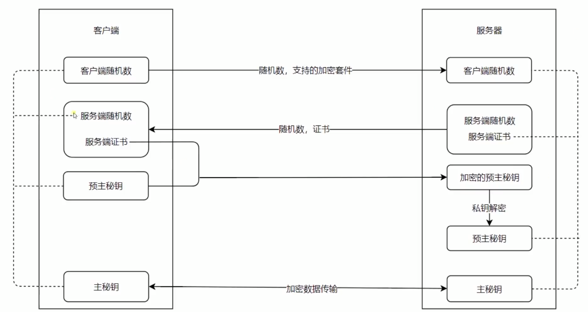

<!--
 * @Description: In User Settings Edit
 * @Author: your name
 * @Date: 2019-09-24 14:58:38
 * @LastEditTime: 2019-09-24 15:10:48
 * @LastEditors: Please set LastEditors
 -->

## HTTP

> 是不安全的协议，是通过明文传输，所以在做 HTTP 服务的时候要尽量保证重要的数据不要通过 HTTP 明文传输

## 加密

- 私钥
  > 放在服务器上的用来解密的公钥的字符串，不会放到互联网上进行传输
- 公钥
  > 放在互联网上所有人都能拿到的一串加密的字符串，是用来加密传输的信息的，使用公钥加密之后的数据传输到服务器之后只有服务器通过私钥进行解密，才能把公钥加密过后的数据解密出来

## 传输过程

